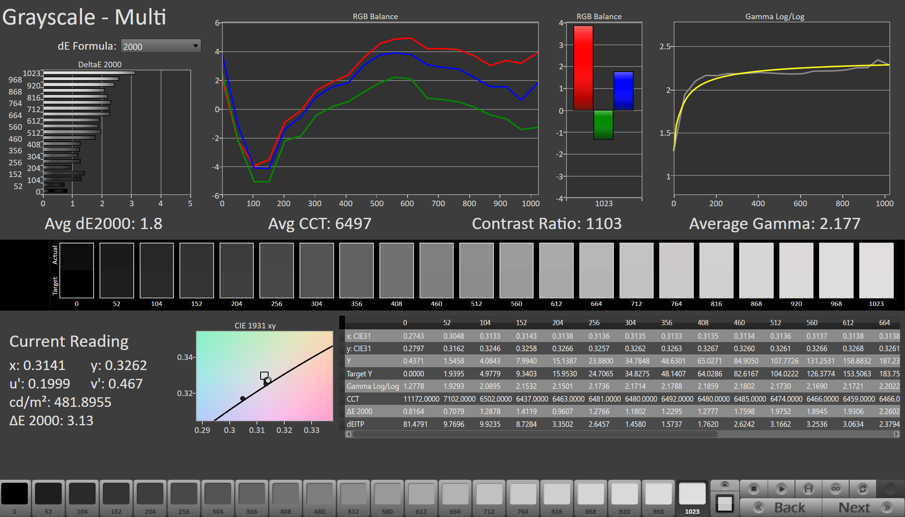
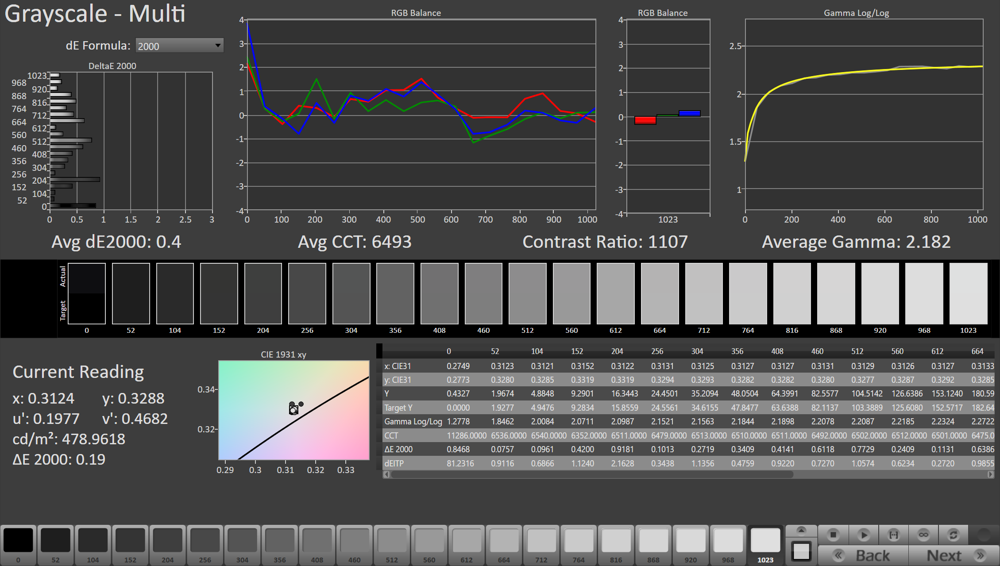
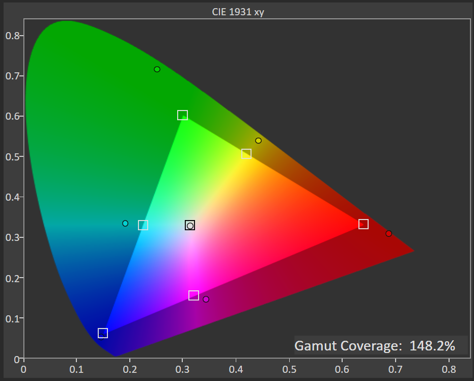
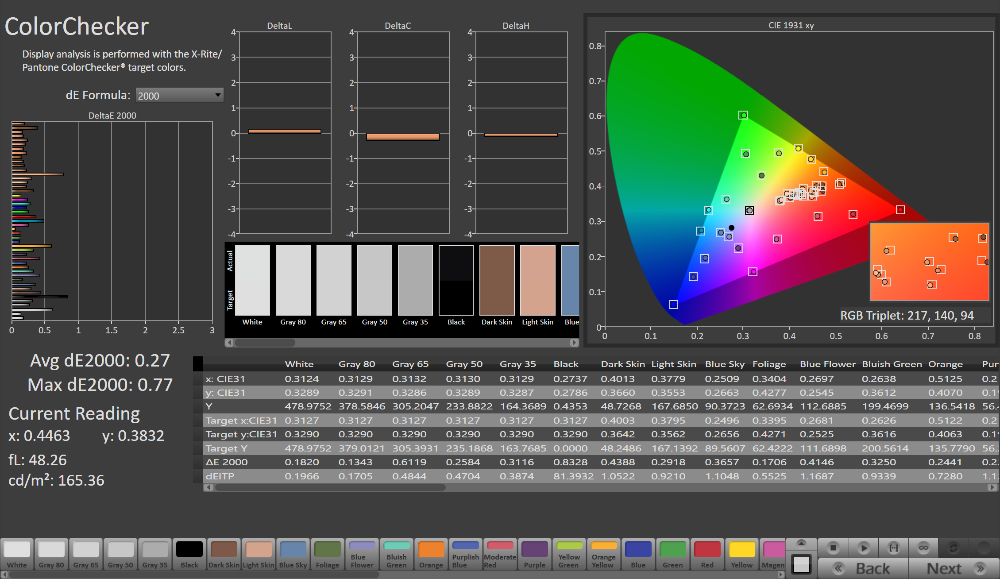
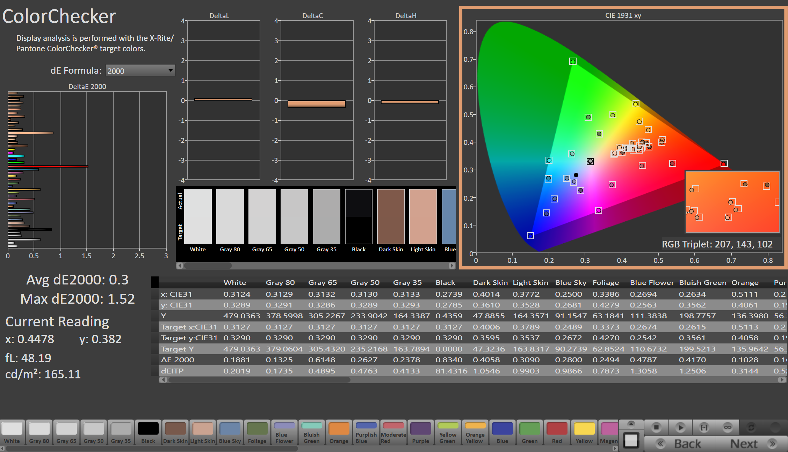

# BOE NE160QDM-NM7 Calibration Report

## Setting up

- Adjusted panel backlight setting: 482 nits at native
- Local Dimming: Disabled
- Target Color Space: sRGB, P3D65, Native (for ACM)
- Target White Point: D65
- Target TRC: sRGB

## Ouptput Profiles

- MHC ICC Profile for Legacy Color Management
  - NE160QDM-NM7 SDR sRGB.icc
  - NE160QDM-NM7 SDR P3D65.icc
- MHC ICC Profile for Advanced Color Management (ACM)
  - NE160QDM-NM7 SDR ACM.icc

## Calibration Report

### Grayscale

Post-calibration white point at 479 nits.

| Pre-calibration | Post-calibration |
|:-:|:-:|
|  |  |

### Color Checker

| Pre-cal Native Gamut | Post-cal sRGB |
|:-:|:-:|
|  |  |
| **Post-cal P3D65** |  |
|  |  |
